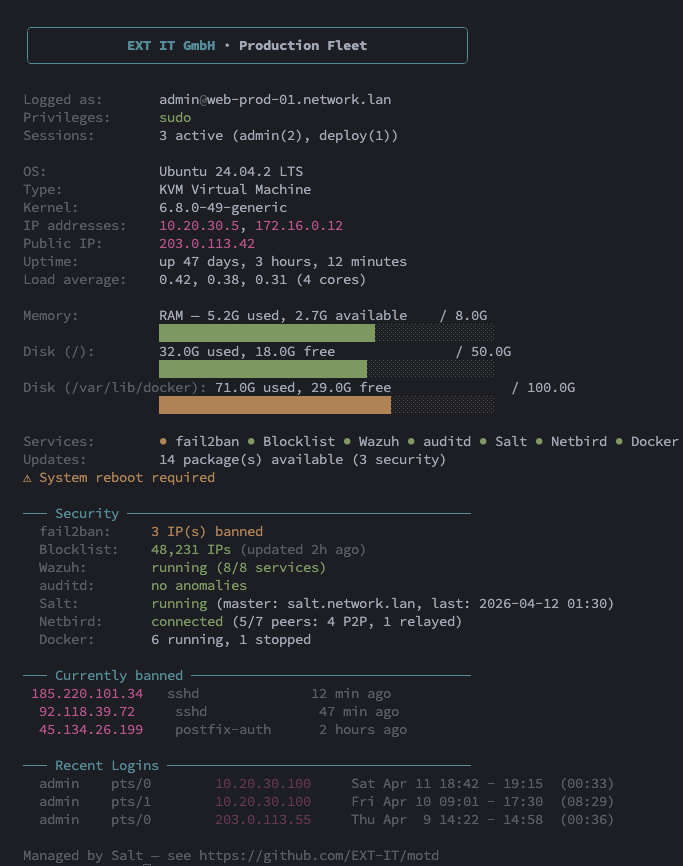

<div align="center">

# 🛡️ motd

**A pre-login warning banner _and_ a dynamic post-login MOTD for Linux — from one config, in one install.**

[](LICENSE)
[](CHANGELOG.md)
[](install.sh)
[](salt/)
[](#-requirements)
[](https://www.conventionalcommits.org/)
[](https://ext-it.tech)

<sub><b>pre-login warning · dynamic system-info dashboard · zero runtime deps · Salt + standalone from one schema</b></sub>

Version: **v1.0.1** — see the [CHANGELOG](CHANGELOG.md) for release notes.

</div>

---

Every Linux fleet ends up with two hand-written shell snippets nobody wants to
touch: one that prints a legal warning before SSH auth, and one that prints
system facts after login. Both drift across hosts, both ship with an off-by-two
bug the next time someone edits them, and both land in `/tmp/.foo_pubip` the
moment the author needs a cache.

**`motd` replaces both** with a single, auditable tool that ships in two flavours:

- 🐚 a **standalone shell installer** (`install.sh`) for bootstrap scripts, golden images, and one-off hosts,
- 🧂 a **SaltStack formula** (`salt/`) that plugs into any Salt 3006+ tree.

Both variants are driven by the **same `/etc/motd.conf`** schema, so a
Salt-managed host and a hand-installed VM render byte-identical output. The
Salt formula deploys the exact same bash script the standalone installer ships
— no Jinja-at-runtime, no template drift.

> 💬 **Announcement**: [📢 read the LinkedIn post](https://www.linkedin.com/feed/update/urn:li:activity:7448342578258874368/) · 🏢 **Built by** [EXT IT GmbH](https://ext-it.tech) · 📦 **Repo** [github.com/EXT-IT/motd](https://github.com/EXT-IT/motd)

## 📺 What you get

### 1. The pre-login banner (`/etc/issue.net`)

Shown by OpenSSH **before authentication** — a legally-enforceable warning
carrying a specific statute citation. The ASCII twin under `/etc/issue` is
written at the same time for the local console.

```
╔════════════════════════════════════════════════════════╗
║  WARNING: Authorized access only.                      ║
║  This system is property of Acme Corp.                 ║
║  Unauthorized access is strictly prohibited.           ║
║  All connections are monitored and logged.             ║
║  Contact: ops@acme.example                             ║
║  Violations prosecuted under §202a StGB.               ║
╚════════════════════════════════════════════════════════╝
```

### 2. The dynamic MOTD (`/etc/update-motd.d/10-system-info`)

Shown **after** authentication — one-screen operational dashboard with everything
an admin wants to see in the first two seconds of a session.



## ✨ Features

### Banner side

- **Dual-output**: writes `/etc/issue` (flat ASCII for the local console) and `/etc/issue.net` (Unicode box for SSH) in one pass — guaranteed to agree.
- **Auto-growing box**: `BOX_WIDTH = max(min_width, longest_line + 4)`, capped at 120. Long tenant names can never silently overflow.
- **Three box styles**: `double` (`╔═╗║╚═╝`), `single` (`┌─┐│└─┘`), `ascii` (`+=|`).
- **EN + DE presets** out of the box, with ASCII transliteration for `/etc/issue` so boot consoles without a UTF-8 font still render cleanly.
- **Legal citation** as a first-class field. Default `§202a StGB` (German `Ausspähen von Daten`), swap for your jurisdiction via one flag.
- **Automatic `sshd_config.d/` drop-in** with `sshd -t` validation before reload — a broken config is reverted, never shipped.

### MOTD side

- **Branded header box** (rounded corners, auto-centered, auto-growing).
- **Service health summary** — fail2ban, Blocklist (ipset), Wazuh, auditd, Salt minion, Netbird, Docker, WireGuard, OpenVPN, Restic/Borg, plus **30+ infrastructure daemons** detected automatically via one batched `systemctl is-active`.
- **Security drilldown** — fail2ban ban list with relative timestamps (bounded detail at 10 IPs), blocklist size + last update, Wazuh subsystem count, auditd anomaly count, Salt last-apply timestamp, Netbird peer count (P2P vs relayed), Docker running/stopped split.
- **Disk + memory bars** with green → yellow → red thresholds (70% / 90%).
- **Updates count** locale-neutral — works on `de_DE`, `fr_FR`, any gettext-localised `update-notifier` output. Security subset highlighted in yellow.
- **Recent logins** scoped to the **currently-logged-in user only** (no fleet-wide session leak via `last -n 5`).
- **Runtime toggles** — `--no-motd-services`, `--no-motd-updates`, `--no-motd-logins` gate entire blocks without touching the script.
- **Verbose mode** opt-in (kernel version + public IP) per CIS Ubuntu 24.04 L1 §1.7.x recon-surface reduction.

### Cross-cutting

- **Zero runtime dependencies** — no Python, no curl-to-fetch-deps, no package install during provisioning.
- **Hot-path audited** — every external command in the MOTD is wrapped in `timeout 2`. A hung daemon socket cannot block an SSH login.
- **Atomic writes + timestamped backups** — never leaves `/etc/issue*`, `/etc/motd.conf`, or the sshd drop-in in a half-written state. A `.latest.bak` symlink always points at the most recent backup.
- **Idempotent** — re-running with the same config is a no-op on disk, and `sshd` is only reloaded when something actually changed.
- **Atomic `sshd` guard** — every reload is preceded by `sshd -t`; a bad drop-in is reverted before the daemon sees it.
- **Input sanitation** — control characters, ANSI escapes, overlong strings, and shell-metacharacters (``\`` `` ` `` `$` `"`) are rejected at install time. The public-IP cache is root-owned and character-whitelisted on read.
- **Dry-run** (`--dry-run`) shows all three phases (banner, MOTD, sshd) before touching disk.
- **Uninstaller** restores from the most recent backup or cleanly removes files.
- **Apache-2.0 licensed** — use it, fork it, ship it in your product.

## ⚡ Performance

The MOTD script runs on the SSH login critical path (invoked by `pam_motd`
as root on every interactive session). It is audited to keep that hot path
short and bounded:

| Metric (warm cache)        | Typical     | Worst case (real-world load) |
|----------------------------|-------------|------------------------------|
| Hot-path median            | ~500-600 ms | ~700 ms                      |
| Cold-cache first login     | +50-100 ms  | up to ~800 ms                |
| Hard upper bound per call  | 2 s         | 2 s (per daemon probe)       |

Measured on an Ubuntu 24.04.3 LXC with a realistic service surface: `fail2ban`
with active bans, `docker` with running containers, `wazuh-agent` connected,
`~50` pending package updates, and `update-notifier` with an ESM preamble.
Figures are warm-cache median over 15 consecutive runs. Your numbers will
be lower on bare metal and on hosts with fewer active services, and
marginally higher on the first login after reboot (cold bash hash table,
cold dentry cache).

The budget is held by a small set of hard rules — if you modify the runtime
script, keep them intact:

- **No `salt-call` anywhere.** Booting the Salt Python interpreter costs
  ~300-800 ms per call on LXC. The "last Salt apply" indicator is read
  from the `mtime` of a marker file that the formula touches on every
  `state.apply` (`/var/cache/motd/salt-status`).
- **`timeout 2` around every daemon-socket call.** `fail2ban-client`,
  `docker ps`, `netbird status`, `wazuh-control status`, `wg show`. A hung
  socket cannot block an SSH login — the worst case is the daemon being
  reported as `?` and a 2 s ceiling on detail.
- **No full-scan of log files.** `fail2ban-client get <jail> banip --with-time`
  (in-memory state, not log grep); `/var/lib/update-notifier/updates-available`
  cache (not `apt list --upgradable`). The update-notifier parser is
  scan-based and locale-neutral, so Ubuntu's ESM preamble does not push it
  into the slow `apt` fallback.
- **Fork-free binary probes.** Availability checks use `hash <name>` at the
  top of the service-checks section. `hash` is a bash builtin that walks
  `$PATH` once, stores the resolved binary in bash's internal hash table,
  and lets every later invocation skip the PATH walk entirely.
- **Terse enumeration variants.** `ipset -t list` (header only, never the
  full member dump); `systemctl list-unit-files` cached into a shell
  variable; one batched `systemctl is-active "${units[@]}"` for all
  dynamic-discovery candidates; `docker ps -a --format '{{.State}}'`
  once (never twice, never a full `ps -a` dump).
- **Cached public-IP probe.** 1 h TTL, root-owned cache at
  `/var/cache/motd/pubip`, character-whitelisted on read
  (`tr -dc '0-9a-fA-F:.'`), skipped entirely on Proxmox hosts where
  there is typically no default route.

If you want to measure on your own host:

```bash
# Warm the script once, then time 15 runs
sudo bash /etc/update-motd.d/10-system-info > /dev/null
for i in $(seq 1 15); do
  /usr/bin/time -f '%e' sudo bash /etc/update-motd.d/10-system-info > /dev/null
done 2>&1 | sort -n
```

If a median run on your host costs more than ~800 ms, the most likely
causes are (a) an unresponsive daemon socket eating its 2 s timeout
(check with `strace -f -e trace=execve`), (b) `landscape-common`'s
`50-landscape-sysinfo` still executable and duplicating system-info
gathering (the installer skips this symlink by design — see the
`--dry-run` output), or (c) a large `fail2ban` ban list above the
`MAX_DETAIL=10` cap still being scanned (it shouldn't be — the summary
path is O(1) per jail, not O(bans)).

## 🔧 Requirements

| Component       | Version / detail                                                                 |
|-----------------|----------------------------------------------------------------------------------|
| OS (banner)     | Debian/Ubuntu 20.04+, RHEL/Rocky/Alma/CentOS 8+, Fedora (any maintained release) |
| OS (MOTD)       | Ubuntu 22.04 LTS or 24.04 LTS (uses the `update-motd.d` hook + update-notifier)  |
| Shell           | bash 4+ (macOS bash 3.2 works for the installer but not for the runtime MOTD)    |
| OpenSSH         | 8.2+ for the `sshd_config.d/` drop-in path; older servers fall back to append     |
| Salt            | 3006 LTS (Onedir) or later — for the Salt variant only                           |
| Privileges      | Root at install time. The MOTD runs as root via `pam_motd`, no setuid.           |

## 🚀 Quickstart

### Option A — standalone shell installer

```bash
git clone https://github.com/EXT-IT/motd.git
cd motd
sudo ./install.sh --company-name "Acme Corp" --contact "ops@acme.example"
```

> **Why no `curl | bash` one-liner?** The installer needs the runtime MOTD
> script (`motd/10-system-info.sh`) from the repo directory. A piped install
> cannot access sibling files, so a full clone (or tarball extraction) is
> required.

Preview everything without touching disk:

```bash
sudo ./install.sh --dry-run --company-name "Acme Corp"
```

Use a persistent config file (the installer reads `/etc/motd.conf` automatically when present):

```bash
sudo cp motd.conf.example /etc/motd.conf
sudo $EDITOR /etc/motd.conf
sudo ./install.sh
```

Install only one half:

```bash
sudo ./install.sh --banner-only --company-name "Acme Corp"   # just the banner
sudo ./install.sh --motd-only --motd-verbose                 # just the MOTD
```

### Option B — SaltStack formula

Drop the state tree into your Salt file roots — no formula packaging, plain directories:

```bash
git clone https://github.com/EXT-IT/motd.git /tmp/motd
sudo cp -r /tmp/motd/salt /srv/salt/motd
sudo cp /tmp/motd/motd/10-system-info.sh /srv/salt/motd/10-system-info.sh
```

The second copy places the runtime MOTD script at `salt://motd/10-system-info.sh`
so the formula's `file.managed` state can reference it. (Alternatively, add the
repo as a GitFS remote — see [`salt/README.md`](salt/README.md).)

Create the pillar (start from `salt/pillar.example.sls`):

```yaml
# /srv/pillar/motd.sls
login_banner:
  banner_enabled: true
  motd_enabled: true
  company_name: "Acme Corp"
  contact: "ops@acme.example"
  motd:
    subtitle: " · Production"
    verbose: false
    footer: "Managed by motd"
  sshd:
    banner_manage: true
```

> The pillar top-level namespace is `login_banner:`. New keys live under the
> `motd:` and `sshd:` sub-namespaces — see [`salt/README.md`](salt/README.md)
> for the full pillar reference.

Wire it into the top files:

```yaml
# /srv/salt/top.sls
base:
  '*':
    - motd

# /srv/pillar/top.sls
base:
  '*':
    - motd
```

Apply:

```bash
salt '*' saltutil.refresh_pillar
salt '*' state.apply motd
```

Detailed Salt usage — targeting, compound matches, multi-tenant layouts — lives
in [`salt/README.md`](salt/README.md).

## ⚙️ Configuration reference

Both variants share the same schema. The **Pillar key** column is the YAML path
under `login_banner:`; the **CLI flag** column is what `install.sh` accepts.
The shell-var column matches what is written into `/etc/motd.conf`.

### Scope flags

Scope flags are **CLI-only** in the shell installer. They are intentionally not
written to `/etc/motd.conf` and not read back from it — persisting them would
let a one-off `--motd-only` run silently disable the banner for every
subsequent install, long after the operator's original intent. For scripted
invocations the shell installer still accepts them via environment variables
(per-invocation, not per-host).

| Pillar key           | CLI flag             | Env var (shell)      | Default | Description                                     |
|----------------------|----------------------|----------------------|---------|-------------------------------------------------|
| `banner_enabled`     | `--no-banner`        | `BANNER_ENABLED`     | `true`  | Install the pre-login banner.                   |
| `motd_enabled`       | `--no-motd`          | `MOTD_ENABLED`       | `true`  | Install the post-login MOTD.                    |
| `sshd:banner_manage` | `--no-sshd-banner`   | `SSHD_BANNER_MANAGE` | `true`  | Write the `sshd_config.d/` drop-in.             |
| _(shell only)_       | `--banner-only`      | —                    | —       | Alias for `--no-motd`; forces sshd banner on.   |
| _(shell only)_       | `--motd-only`        | —                    | —       | Alias for `--no-banner --no-sshd-banner`.       |

### Banner keys

| Pillar key               | CLI flag              | Shell var         | Default                  | Description                                                                            |
|--------------------------|-----------------------|-------------------|--------------------------|----------------------------------------------------------------------------------------|
| `company_name`           | `--company-name`      | `COMPANY_NAME`    | `Managed Server`         | Shown in the "property of" line. Max 64 chars. Control chars / ANSI are rejected.      |
| `contact`                | `--contact`           | `CONTACT`         | _(empty)_                | Optional contact line rendered above the statute. Omitted entirely when empty.         |
| `language`               | `--language`          | `LANGUAGE`        | `en` (`en` \| `de`)      | Preset warning text. German ASCII variant transliterates `ü→ue`, `ö→oe`, `ß→ss`.       |
| `style`                  | `--style`             | `STYLE`           | `double`                 | `double` \| `single` \| `ascii`. Box drawing for `/etc/issue.net` only.                |
| `min_width`              | `--min-width`         | `MIN_WIDTH`       | `56`                     | Minimum inner box width. Auto-grows to `longest_line + 4`. Hard cap at 120.            |
| `statute`                | `--statute`           | `STATUTE`         | `§202a StGB`             | Unicode legal citation for `/etc/issue.net`.                                           |
| `statute_ascii`          | `--statute-ascii`     | `STATUTE_ASCII`   | `section 202a StGB`      | ASCII legal citation for `/etc/issue` (ASCII-safe boot console).                       |
| `issue_file`             | `--issue-file`        | `ISSUE_FILE`      | `/etc/issue`             | Target path for the local-console banner.                                              |
| `issue_net_file`         | `--issue-net-file`    | `ISSUE_NET_FILE`  | `/etc/issue.net`         | Target path for the SSH banner.                                                        |
| `clear_motd`             | `--no-clear-motd`     | `CLEAR_MOTD`      | `true`                   | Blank out `/etc/motd` (the static file). Pass the flag to preserve existing content.   |
| `sshd_reload`            | `--no-sshd-reload`    | `SSHD_RELOAD`     | `true`                   | Non-disconnecting `systemctl reload sshd` when the banner actually changed.            |
| `warning_lines_override` | `--warning-lines` (repeatable) | `WARNING_LINES_OVERRIDE` | `[]`              | Replace the preset warning lines verbatim. The statute is still appended. CLI form is repeatable: `--warning-lines "Line 1" --warning-lines "Line 2"`. Config-file form is single-quoted with literal `\n` separators: `WARNING_LINES_OVERRIDE='Line 1\nLine 2'` (the double-quoted form would be rejected because the parser refuses backslash inside `"…"`). Per-line cap 128 chars; single quote, shell metacharacters (`$ \` " \\`), control characters, and emoji are rejected at install time. |

### MOTD keys

| Pillar key                 | CLI flag                 | Shell var                  | Default                  | Description                                                                              |
|----------------------------|--------------------------|----------------------------|--------------------------|------------------------------------------------------------------------------------------|
| `motd:subtitle`            | `--motd-subtitle`        | `MOTD_SUBTITLE`            | ` · Managed Server`      | Subtitle after the company name in the MOTD header. Leading separator is intentional.   |
| `motd:min_width`           | `--motd-min-width`       | `MOTD_MIN_WIDTH`           | `54`                     | Minimum MOTD header box width. Auto-grows to fit `company_name + subtitle + 4`.          |
| `motd:verbose`             | `--motd-verbose`         | `MOTD_VERBOSE`             | `false`                  | Show kernel version and public IP. Off by default (CIS L1 §1.7.x).                       |
| `motd:footer`              | `--motd-footer`          | `MOTD_FOOTER`              | _(empty)_                | Optional dim footer line. Typical: `"Managed by motd"`.                                  |
| `motd:show_services`       | `--no-motd-services`     | `MOTD_SHOW_SERVICES`       | `true`                   | Show the Services / Security blocks.                                                     |
| `motd:show_updates`        | `--no-motd-updates`      | `MOTD_SHOW_UPDATES`        | `true`                   | Show the Updates line and the "reboot required" warning.                                 |
| `motd:show_recent_logins`  | `--no-motd-logins`       | `MOTD_SHOW_RECENT_LOGINS`  | `true`                   | Show the Recent Logins block (scoped to the current user).                               |
| `motd:security_priv_only`  | `--motd-security-priv-only` | `MOTD_SECURITY_PRIV_ONLY`  | `false`                  | Only render the Security / Currently-banned blocks for users in sudo/wheel/admin. Shared-bastion / jump-host safety. |
| `motd:pubip_url`           | _(config file only)_     | `MOTD_PUBIP_URL`           | `https://ifconfig.me`    | Public-IP probe endpoint. Restricted to `^https?://[A-Za-z0-9./_:?=&%-]+$` (query strings allowed). |
| `motd:script_path`         | `--motd-script-path`     | `MOTD_SCRIPT_PATH`         | `/etc/update-motd.d/10-system-info` | Where the runtime MOTD script lands.                                         |
| `motd:config_path`         | `--motd-config-path`     | `MOTD_CONFIG_PATH`         | `/etc/motd.conf`         | Where the unified runtime config file lands.                                             |
| `motd:cache_dir`           | `--motd-cache-dir`       | `MOTD_CACHE_DIR`           | `/var/cache/motd`        | Root-owned cache dir for the public-IP cache + apply-time marker. Must NOT live under `/tmp`, `/var/tmp`, or `/dev/shm`. |
| `sshd:banner_dropin`       | `--sshd-dropin`          | `SSHD_BANNER_DROPIN`       | `/etc/ssh/sshd_config.d/99-motd-banner.conf` | Path to the sshd_config drop-in that wires `Banner /etc/issue.net` for new SSH logins. |

### Common shell-only options

| CLI flag             | Default                     | Description                                                    |
|----------------------|-----------------------------|----------------------------------------------------------------|
| `--backup-dir DIR`   | `/var/backups/motd`         | Where timestamped backups land. Created mode 0700 on first write. |
| `--no-backup`        | `false` (backups enabled)   | Disable backups (not recommended).                             |
| `--config PATH`      | `/etc/motd.conf` if present | Shell-style config file parsed (never sourced) by the installer. |
| `--dry-run`, `-n`    | `false`                     | Render to stdout; make no changes.                             |
| `--force`, `-f`      | `false`                     | Overwrite without prompting even if backups are disabled.      |
| `--uninstall`        | —                           | Invoke `uninstall.sh` from the same directory.                 |
| `--help`, `-h`       | —                           | Grouped usage reference.                                       |
| `--version`          | —                           | Print version.                                                 |

Precedence (shell): **CLI flags > environment variables > config file > built-in defaults**.

### sshd reload semantics

**Differs between standalone and Salt** — by design, both pathways converge on the same operational invariant.

The standalone installer uses a single global `SSHD_RELOAD=true/false` (CLI flag `--no-sshd-reload`). Salt uses two separate pillar keys: `login_banner:sshd_reload` (banner.sls) and `login_banner:sshd:reload` (motd.sls — the W4 split). Both pathways reach the invariant "deploy the drop-in, do not reload sshd now," which is what an operator needs during a change window: stage the new config but defer the reload to an approved maintenance slot.

The Salt split additionally allows banner-reload ≠ motd-reload granularity — useful only for the rare workflow where an operator wants to stage the MOTD drop-in while reloading sshd for the banner immediately (or vice versa). Standalone collapses both into one knob because `install.sh` runs the phases sequentially and a per-artefact split is harder to reason about on a single command line.

If you flip between the two deployment modes, the upgrade path is straightforward: a `SSHD_RELOAD=false` standalone config becomes `login_banner:sshd_reload: false` AND `login_banner:sshd:reload: false` on the Salt side. Setting only one of the two leaves the other reload enabled.

## 📚 Example configurations

Four ready-to-adapt shell configs live under [`examples/`](examples/):

<details>
<summary><b><code>config-minimal.conf</code> — the two-field starter</b></summary>

```sh
COMPANY_NAME="Acme Corp"
CONTACT="ops@acme.example"
```

Everything else defaults. Banner + MOTD + sshd drop-in all enabled.

</details>

<details>
<summary><b><code>config-corporate.conf</code> — managed-infrastructure baseline</b></summary>

```sh
COMPANY_NAME="Acme Corporation"
CONTACT="security@acme.example"
LANGUAGE="en"
STYLE="double"
MIN_WIDTH=64
STATUTE="§202a StGB"
STATUTE_ASCII="section 202a StGB"
CLEAR_MOTD=true

MOTD_SUBTITLE=" · Managed Server"
MOTD_MIN_WIDTH=58
MOTD_VERBOSE=false
MOTD_FOOTER=""
MOTD_SHOW_SERVICES=true
MOTD_SHOW_UPDATES=true
MOTD_SHOW_RECENT_LOGINS=true

SSHD_RELOAD=true
BACKUP=true
BACKUP_DIR="/var/backups/motd"
```

Both halves enabled (the default — scope flags are CLI-only), contact set,
sshd drop-in active, verbose mode off, backups on.

</details>

<details>
<summary><b><code>config-paranoid.conf</code> — heaviest statute, MOTD installed with every optional block disabled</b></summary>

```sh
COMPANY_NAME="Acme Restricted Systems"
CONTACT="abuse@acme.example"
LANGUAGE="en"
STATUTE="§202a StGB · GDPR Art. 32 · BSI SYS.1.3.M6 · all access logged"
STATUTE_ASCII="section 202a StGB / GDPR Art. 32 / BSI SYS.1.3.M6 / all access logged"
# ... plus MOTD_SHOW_SERVICES=false, MOTD_SHOW_UPDATES=false,
# MOTD_SHOW_RECENT_LOGINS=false, MOTD_VERBOSE=false.
```

Install with the default scope (no extra scope flag):

```bash
sudo ./install.sh --config examples/config-paranoid.conf
```

The pre-login banner carries a long multi-clause statute citation (BSI,
GDPR, German Criminal Code); the post-login MOTD is **installed** but
rendered with every optional information block disabled — no services
row, no updates line, no Recent Logins, no kernel / public IP. The
post-auth screen shows only the company header box, system identity
(FQDN, OS, IPs, uptime, load) and the resource bars. A lateral-movement
attacker who gains one session learns the host identity and nothing
about running defences.

If you want the stricter profile where the post-login MOTD is skipped
entirely (banner + sshd wiring only), add `--banner-only` to the
install command above. For shared bastion hosts, combine with
`--motd-security-priv-only` so non-sudo users see neither the Services
row nor the Security block even if you re-enable them later.

</details>

<details>
<summary><b><code>config-full.conf</code> — every option demonstrated</b></summary>

See [`examples/config-full.conf`](examples/config-full.conf) — every single key
set to a non-default value with a one-line comment per key explaining why you
might want that choice.

</details>

## 🧹 Uninstall

### Standalone

```bash
sudo ./uninstall.sh                 # restore the most recent backup of each file
sudo ./uninstall.sh --dry-run       # show what would happen
sudo ./uninstall.sh --purge         # also remove /etc/motd.conf and /var/cache/motd
sudo ./uninstall.sh --keep-cache    # default — preserve the public-IP cache
```

If no backup is available, the uninstaller prints a warning and leaves the
file alone — it will never delete `/etc/issue` and lock you out of the local
console. The sshd drop-in is always removed cleanly and `sshd -t` is run
before any reload.

> **FAQ — Hand-edits and re-install.** Ownership of motd-created files is
> tracked via `.created` marker files under `/var/backups/motd/`. A file the
> installer wrote from nothing (e.g. `/etc/motd.conf` on a host that never
> had one) has no "pristine" snapshot — the marker is the signal to the
> uninstaller to `rm` the file instead of restoring it. As a side effect,
> **hand-edits to motd-managed files are not preserved on re-install** — a
> subsequent run will overwrite your edits without a backup, because the
> presence of the marker means "we still own this file".
>
> To keep your changes after a re-install, delete the corresponding marker
> first: `sudo rm /var/backups/motd/<basename>.created`. The next install
> run will then treat the file as an operator artefact, capture a pristine
> backup, and you can merge your edits from that backup.

### SaltStack

Remove the state from your top file, or flip both pillar flags:

```yaml
login_banner:
  banner_enabled: false
  motd_enabled: false
```

Applying the formula with both flags false raises at render time — you have
to untop it rather than apply-empty.

## 🧪 Development & verification

Every commit touching states, templates, or shell must pass:

1. `shellcheck -s bash install.sh uninstall.sh motd/10-system-info.sh` — no warnings.
2. `bash -n install.sh uninstall.sh motd/10-system-info.sh` — syntax.
3. `yamllint salt/*.sls` (Jinja-tolerant config).
4. Jinja render of `salt/*.sls` against a fake pillar with
   `jinja2.Environment(trim_blocks=False, lstrip_blocks=False)` — Salt's
   default — piped through `yaml.safe_load`.
5. A dry-run of `install.sh` against the English default, the German preset,
   a long-name auto-grow case, a `--motd-only` case, a `--banner-only` case,
   and `--motd-verbose --motd-footer "x"`. All must succeed without writing.
6. A runtime render of `motd/10-system-info.sh` via
   `COMPANY_NAME="Test Co" MOTD_SUBTITLE=" · Lab" bash motd/10-system-info.sh`
   — the header box must auto-grow and center.

See [`CHANGELOG.md`](CHANGELOG.md) for the release history.

## 🗂️ Repository layout

```
motd/                            # repo root on GitHub: github.com/EXT-IT/motd
├── install.sh                   # standalone installer (banner + MOTD + sshd)
├── uninstall.sh                 # standalone uninstaller with backup restore
├── motd.conf.example            # unified shell config (banner + MOTD + sshd)
├── motd/
│   └── 10-system-info.sh        # runtime MOTD script (no Jinja — shared with Salt)
├── examples/
│   ├── config-minimal.conf      # two-field starter
│   ├── config-corporate.conf    # managed-infrastructure baseline
│   ├── config-paranoid.conf     # banner only, heaviest statute
│   └── config-full.conf         # every option demonstrated
├── salt/
│   ├── init.sls                 # thin include wrapper
│   ├── banner.sls               # pre-login banner state
│   ├── motd.sls                 # MOTD + sshd state
│   ├── pillar.example.sls       # documented pillar
│   ├── README.md                # Salt-specific usage
│   └── examples/                # pillar examples mirroring examples/config-*.conf
│       ├── pillar-minimal.sls   # 1:1 with config-minimal.conf
│       ├── pillar-corporate.sls # 1:1 with config-corporate.conf
│       ├── pillar-paranoid.sls  # 1:1 with config-paranoid.conf
│       └── pillar-full.sls      # 1:1 with config-full.conf
├── LICENSE                      # Apache-2.0
├── CHANGELOG.md                 # Keep a Changelog format
├── .editorconfig
├── .gitignore
└── README.md                    # you are here
```

## 🤝 Contributing

Contributions are welcome. A good patch:

- follows [Conventional Commits](https://www.conventionalcommits.org/) (`feat:`, `fix:`, `docs:`, `refactor:`, `test:`, `chore:`, `ci:`, `perf:`, `style:`),
- keeps the shell and Salt variants in output parity (add a test case if you change the rendering),
- passes `shellcheck`, `yamllint`, and the render tests described in [Development & verification](#-development--verification),
- updates [`CHANGELOG.md`](CHANGELOG.md) under `## [Unreleased]`,
- includes a **Why** paragraph in the commit body for any security- or compliance-relevant change.

For larger changes, open an [issue](https://github.com/EXT-IT/motd/issues)
first so we can sanity-check the approach.

## 📜 License

Released under the [Apache License 2.0](LICENSE). Copyright © 2026 **[EXT IT GmbH](https://ext-it.tech)**.

The Apache-2.0 license includes an explicit patent grant and clear
contribution terms, which we consider the right default for an
infrastructure / security tool published by a company. You are free to use,
modify, and redistribute this code in commercial and non-commercial settings
as long as you preserve the copyright and license notice.

## 🔗 Links

- 📦 **Repository**: [github.com/EXT-IT/motd](https://github.com/EXT-IT/motd)
- 🏢 **Maintainer**: [EXT IT GmbH](https://ext-it.tech)
- 📢 **Announcement**: [LinkedIn post](https://www.linkedin.com/feed/update/urn:li:activity:7448342578258874368/)
- 🐞 **Issues**: [github.com/EXT-IT/motd/issues](https://github.com/EXT-IT/motd/issues)
- 📝 **Changelog**: [CHANGELOG.md](CHANGELOG.md)

---

<div align="center">

**Repo description one-liner:**
_Pre-login warning banner and dynamic post-login MOTD for Linux — standalone shell installer and SaltStack formula from one unified schema._

<sub>Built and maintained by <a href="https://ext-it.tech">EXT IT GmbH</a>. PRs welcome.</sub>

</div>
